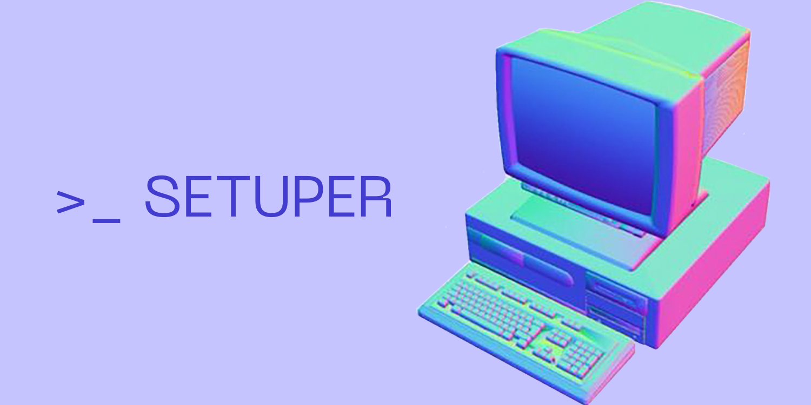

# Setuper



Setuper is a macOS-first Python CLI for capturing and restoring reproducible work
setups. A setup records the intent of a workspace—projects, commands, services,
applications, browser tabs, and window placement—without pretending to freeze
process memory or live network state.

## Status

Setuper is under active development toward v1.0.0 and is not ready for general
use. The [task plan](docs/tasks.md) is the source of truth for implementation
progress.

## Design

- Human-readable YAML manifests define the desired setup.
- SQLite records launches, approvals, process ownership, and history.
- Adapters isolate application and platform integrations from the core domain.
- Imported executable setups require approval bound to their exact manifest hash.
- Unsupported or partial restoration is reported explicitly.

Official v1.0.0 support targets Python 3.12 and 3.13 on macOS 14 or newer.

## Development setup

```bash
python3.12 -m venv .venv
source .venv/bin/activate
python -m pip install --editable .
```

The development checks and their dependencies will be added during Phase 0.

## Documentation

- [Product idea](docs/idea.md)
- [Specifications](docs/specs.md)
- [Architecture](docs/architecture.md)
- [Security model](docs/security.md)
- [Security reporting policy](SECURITY.md)
- [Testing strategy](docs/testing.md)
- [Known limitations](docs/known-issues.md)
- [Implementation tasks](docs/tasks.md)
